# ResolveFlow Replay executable implementation plan

**Plan version:** 1.1

**Planning date:** 2026-07-21

**Branch:** `main`

**Status:** Milestones 1-6 implemented; Milestone 7 not started
**Authority:** `AGENTS.md` -> `docs/CODEX_MASTER_PROMPT_ResolveFlow.md` -> master-plan PDF -> feature specifications -> current official documentation -> repository conventions

This plan turns the supplied ResolveFlow Replay blueprint into an ordered, testable build program. Resolve is the incident workflow; Replay is the product that decides whether a versioned candidate is fit for the declared deployment profile. The same production orchestration path must serve interactive Resolve runs, deterministic fixtures, recorded snapshots, and Replay.

## 1. Planning baseline

The repository was an empty Git remote plus an untracked documentation bundle when planning began. At Stage 00 entry it contained the checked-in source/planning set and finite automation-loop configuration, but no application code, package manifests, lockfiles, database migrations, CI workflows, or product tests. The authoritative 87-page PDF was found in the supplied local build pack, reviewed in full, checksummed, and placed at `docs/reference/ResolveFlow_Replay_Master_Plan.pdf`. The Markdown specifications and their three images were normalized under `docs/spec/` without content changes.

No test, provider call, integration, deployment, reviewer result, cost, performance measure, release verdict, or public URL exists yet. Every future evidence claim must come from an artifact generated by the implementation.

### 1.1 Product boundaries

In scope:

- one synthetic B2B payments incident domain and one canonical hero case;
- a Slack-style web intake and a disabled real Slack adapter;
- deterministic context tools, versioned evidence, pre-retrieval authorization, hybrid retrieval, Rerank, a bounded Command loop, an evidence graph, a two-pass response, and post-generation verification;
- one inert Jira create proposal, exact approval binding, a synthetic connector, a disabled Jira Cloud adapter, durable execution, reconciliation, and audit;
- frozen Replay manifests, unsafe-v0 and guarded-v1, deterministic and bounded-live evaluation, release gates, and a snapshot-first public product;
- local web/API/worker/PostgreSQL operation, tests, CI, documentation, and GitHub Pages.

Out of scope:

- arbitrary prompts, uploads, URLs, SQL, shell access, or browser tools;
- autonomous remediation or direct model writes;
- more ticketing systems or write action types;
- email, audio, general screenshot parsing, or general web retrieval;
- microservices, Kafka, Redis/Celery, Kubernetes, a separate search/vector service, GraphQL, agent frameworks, fine-tuning, or a second LLM provider;
- paid infrastructure, production-security claims, invented customer evidence, or unsupported multilingual claims.

## 2. Target repository structure

```text
ResolveFlow/
|-- .github/workflows/
|   |-- validate.yml
|   |-- pages.yml
|   `-- release-evaluation.yml
|-- automation/                       # finite outer loop, stage prompts, result schema
|-- apps/web/                         # Next.js static public app and local operator UI
|-- python/resolveflow/
|   |-- api/                          # FastAPI routes, auth dependencies, SSE
|   |-- domain/                       # shared types, IDs, errors, state machines
|   |-- intake/                       # web/Slack normalization and deduplication
|   |-- ingestion/                    # artifacts, versions, parsing, chunking
|   |-- retrieval/                    # lexical, vector, fusion, Rerank
|   |-- policy/                       # ACL, action policy, redaction, gates
|   |-- agent/                        # bounded Command loop and evidence graph
|   |-- verifier/                     # claims, citations, freshness, conflict
|   |-- actions/                      # proposal, approval, queue, dispatch, reconcile
|   |-- replay/                       # manifests, mutations, materialization, diff
|   |-- evaluation/                   # metrics, intervals, verdict, reports
|   |-- adapters/                     # Cohere, Slack, Jira, clock, synthetic adapters
|   |-- telemetry/                    # audit events, traces, safe logs, projections
|   `-- worker/                        # durable job consumers
|-- migrations/                       # Alembic revisions
|-- data/
|   |-- truths/                       # synthetic-agent-authored candidates
|   |-- artifacts/                    # labeled synthetic sources
|   |-- manifests/                    # scenarios, locks, checksums
|   |-- splits/                       # development/calibration/held-out IDs
|   `-- published/                    # sanitized content-addressed snapshots
|-- eval/
|   |-- configs/                      # build, metric, retry, and gate versions
|   |-- rubrics/                      # human-review instruments
|   `-- reports/                      # generated, source-linked reports
|-- tests/
|   |-- unit/
|   |-- integration/
|   |-- contract/
|   |-- browser/
|   |-- security/
|   `-- replay/
|-- docs/
|   |-- adr/
|   |-- reference/
|   |-- spec/
|   |-- IMPLEMENTATION_PLAN.md
|   |-- ACCEPTANCE_MATRIX.md
|   |-- CODEX_STATUS.md
|   `-- DECISIONS.md
|-- infra/docker/                     # local-only images/configuration
|-- scripts/                          # stable command implementations
|-- Makefile
|-- pyproject.toml
|-- uv.lock
|-- package.json
|-- pnpm-lock.yaml
|-- pnpm-workspace.yaml
|-- docker-compose.yml
|-- .env.example
|-- SECURITY.md
|-- CHANGELOG.md
|-- LICENSE
`-- README.md
```

Generated provider responses and any non-public review exports stay outside the public tree unless intentionally sanitized, licensed, checksummed, and approved for publication.

## 3. Architecture and dependency rules

### 3.1 Runtime topology

| Runtime | Owns | Must not contain |
|---|---|---|
| Next.js web | Static public routes, snapshot viewer, local operator UI, review UX | Provider/connector/database credentials; business policy |
| FastAPI application | Auth, case/run APIs, Slack webhook, orchestration, verification, approval, SSE | Background retry loops; direct unapproved writes |
| Python worker | Ingestion, embeddings, replay batches, action dispatch/reconciliation, metrics, snapshot generation | Human approval authority; alternative Replay code path |
| PostgreSQL + pgvector | Transactional state, FTS/vector data, jobs, audit, metrics | Authorization decisions hidden only in prompts |

GitHub Pages hosts the credential-free static public product. The complete dynamic stack is a local/staging profile only unless a future zero-cost, no-billing backend is independently verified and approved by a new ADR.

### 3.2 One production path

```mermaid
flowchart LR
    I["Web, Slack, or Replay input"] --> N["Canonical case + immutable run context"]
    N --> C["Named deterministic context tools"]
    C --> P["Pre-retrieval policy predicate"]
    P --> R["Authorized lexical + vector + fusion + Rerank"]
    R --> A["Bounded Command evidence/tool pass"]
    A --> V["Evidence graph + verifier"]
    V --> S["No-tools structured pass"]
    S --> D["Deterministic renderer"]
    D --> Q["Inert proposal and action state machine"]
    Q --> T["Audit, metrics, snapshot, or Replay verdict"]
```



Replay may replace the clock, identity, corpus snapshot, connector behavior, model adapter mode, and declared fixture inputs. It may not replace the orchestrator, policy, retrieval, verifier, action, or audit modules.

### 3.3 Module API boundaries

| Module | Public application interface | Inputs | Outputs | Forbidden dependency |
|---|---|---|---|---|
| `domain` | versioned Pydantic/domain types, canonical hashing, state transitions | primitives and typed values | immutable domain objects and errors | adapters, web frameworks |
| `intake` | `normalize_web_case`, `normalize_slack_event`, `dedupe_intake` | verified event/form plus identity mapping | `CanonicalCase`, queue request | model/provider calls |
| `ingestion` | `ingest_artifact`, `publish_corpus_snapshot`, `validate_corpus` | labeled source plus parser policy | versioned chunks, ACLs, manifest | user authorization grants |
| `policy` | `compile_evidence_policy`, `authorize_tool`, `authorize_action`, `project_public_trace` | immutable identity/case/policy snapshot | allow/deny reason codes and eligible IDs | natural-language judgment |
| `retrieval` | `retrieve_candidates`, `rerank_candidates` | query, eligible-ID relation, model policy | bounded traced candidates | widening eligibility |
| `agent` | `run_evidence_pass`, `structure_verified_response` | case, authorized evidence, typed tools | draft findings and structured response | connector writes |
| `verifier` | `build_evidence_graph`, `verify_claims` | exact context, citations, tool evidence, ACL snapshot | verified graph and disposition | unsupported rewrite |
| `actions` | `create_proposal`, `approve_or_reject`, `claim_dispatch`, `reconcile` | verified graph, identity, exact digest | action transitions and attempts | model/human self-approval |
| `replay` | `validate_manifest`, `materialize_scenario`, `run_replay`, `diff_runs` | frozen truth/build/policy/fixtures | standard run IDs and scenario evidence | benchmark-only agent path |
| `evaluation` | `score_runs`, `compare_builds`, `evaluate_gate`, `render_report` | immutable run/result records | metrics, intervals, verdict bundle | silently dropping failures |
| `adapters` | typed ports for Cohere, Slack, Jira, clock, storage | adapter-specific request types | normalized responses/errors | cross-module policy |
| `telemetry` | `append_audit`, `start_span`, `publish_projection` | safe structured events | append-only events/projections | business-state mutation |

Dependency direction is `api/worker -> application modules -> domain/ports`; adapters implement ports and do not import API routers. Cross-module writes occur through application services and one database transaction where state and audit must agree.

### 3.4 Migration ownership

The Python persistence layer owns Alembic metadata and migration scripts. Domain modules define invariants; a single persistence composition root translates them into database tables, constraints, indexes, and grants. API startup, worker startup, and web builds never apply migrations automatically. Milestone work that changes persisted state must include the migration, empty-to-head coverage, compatibility notes, and either a tested downgrade or an explicit irreversible rationale before the application change can be accepted.

Migration responsibility is dependency ordered:

1. Milestone 1 owns identity, case, run, audit, job, and schema-version foundations.
2. Milestone 2 owns artifact, chunk, ACL, embedding, corpus-snapshot, and retrieval-candidate storage.
3. Milestone 3 owns evidence graph, claim, citation, verifier, and provider-call records.
4. Milestone 4 owns proposal, approval, idempotency, attempt, lease, and reconciliation constraints.
5. Milestone 5 owns Replay, expectation, metric, comparison, lock, and release-gate records.
6. Later milestones may expand public projections and review exports but may not silently mutate the operational source of truth.

One Alembic head is maintained. A migration that crosses module ownership is coordinated in the persistence composition root and names every affected module in its revision documentation.

## 4. Shared schemas and contracts

All persisted and published schemas are versioned. Canonical JSON uses sorted keys, UTF-8, normalized timestamps, and no floating-point values in security-sensitive digests without an explicit normalization rule.

### 4.1 Common envelope

Every material object carries:

- stable sortable ID, `schema_version`, `created_at`, and actor/service identity;
- `tenant_id` where applicable;
- `source_system`, content/configuration checksum, and provenance;
- `effective_from`/`effective_to` where applicable;
- build, Git SHA, policy, prompt/tool-schema, corpus, ACL, fixture, and model-policy versions where applicable.

No prior terminal run, artifact version, approval, attempt, audit event, or published result is overwritten. Corrections create a new event/version.

### 4.2 Required domain schemas

| Schema | Required fields beyond the common envelope |
|---|---|
| `CanonicalCase` | reporter, tenant, channel/source, received time, language hint, severity hint, raw synthetic text, normalized identifiers, missing fields |
| `IdentitySnapshot` | user, roles, region, permissions, policy version, captured time |
| `ContextResult` | operation name, typed parameters hash, as-of time, status (`ok/not_found/denied/timeout/malformed/unavailable`), normalized data, provenance IDs |
| `ArtifactVersion` | kind, title, language, classification, owner, effective interval, source checksum, parser/chunker version |
| `Chunk` | artifact version, stable source position, modality, text/caption, ACL IDs, checksum, embedding policy |
| `RetrievalCandidate` | authorized policy decision, lexical/vector/fused/rerank rank and score, payload hash, suppression reason |
| `AgentRun` | case/build/scenario IDs, immutable inputs, budgets, stage status, start/end, terminal reason |
| `ToolCall` | allowlisted name, validated input hash, authorization result, status, timing, output provenance |
| `EvidenceGraph` | verified facts, unknowns, conflicts, route candidates, permitted proposals, exact source refs, verifier codes, graph hash |
| `FinalResponse` | disposition, route/confidence label, summary, recommended steps, unknowns, claim/citation IDs, proposal ID, safety status, graph hash |
| `ActionProposal` | one `create_jira_issue` type, summary, team, priority, verified description, evidence refs, unknowns, risk, expiry, canonical payload digest |
| `Approval` | proposal ID, exact digest, approver, permission/policy result, timestamp, expiry |
| `ActionAttempt` | idempotency key, proposal digest, attempt, lease, request fingerprint, normalized result/error, retry/reconciliation decision |
| `AuditEvent` | sequence, actor, component, event name, safe detail, correlation IDs, versions, previous-event hash where adopted |
| `ReplayManifest` | schema/scenario/truth/build IDs, frozen clock/identity/corpus/ACL/connectors/model policy, one primary mutation, expectations, scoring config, checksum |
| `MetricObservation` | metric version, numerator/denominator or statistic, unit, inclusion/exclusion reason, base-truth cluster, source run IDs |
| `ReleaseVerdict` | gate version, candidate/baseline/dataset lock, hard outcomes, quality outcomes, limitations, `SHIP/SHIP_WITH_LIMITS/NO_SHIP`, evidence links, checksum |
| `PublicSnapshot` | sanitized trace/result, all input hashes, usage only if real, commit, generated time, `recorded` provenance, bundle checksum |

### 4.3 Stable API surface

The planned REST surface is the one in the project overview: case create/read/run, run read/events/trace, exact action approve/reject, replay submit/read, release read, Slack events, liveness, readiness, and version. APIs return a versioned RFC 9457-style problem object with a stable code, request ID, and retryability; raw provider exceptions, prompts, secrets, stack traces, and unrestricted evidence never cross the public boundary.

## 5. State machines

State transitions are domain functions plus database constraints. Invalid transitions fail closed and append a safe audit event.

```text
Case:
new -> enriching -> retrieving -> reasoning -> verifying
    -> awaiting_review -> action_pending -> resolved
any nonterminal -> needs_information | blocked | failed

Run:
queued -> preparing -> context -> retrieving -> reasoning -> verifying
      -> structuring -> completed
any nonterminal -> needs_review | abstained | provider_unavailable | failed | cancelled

Action:
proposed -> pending_approval -> approved -> dispatching -> acknowledged -> complete
pending_approval -> rejected | expired
approved | dispatching -> retry_wait -> dispatching
dispatching | retry_wait -> reconciling -> acknowledged | retry_wait | dead_letter
approved | dispatching | retry_wait | reconciling -> dead_letter

Replay:
queued -> preparing -> running -> scoring -> completed
any nonterminal -> cancelled | failed

Job:
queued -> leased -> running -> complete
leased | running -> retry_wait -> queued
leased | running | retry_wait -> dead_letter | cancelled
```

`dispatching` requires, in one transaction, an approved unexpired exact digest, current action authorization, worker-only dispatch permission, a valid unused idempotency record, and a matching audit event. Uncertain connector acknowledgement always enters reconciliation before a create retry.

## 6. Environment and adapter policy

| Profile | Model | Slack | Jira | Database | Public claim |
|---|---|---|---|---|---|
| snapshot | recorded fixture only | simulated | simulated | none required | recorded synthetic run |
| local full | recorded by default; optional bounded Cohere | mock/contract | synthetic | local PostgreSQL | local development only |
| CI | mock + sanitized contracts | contract fixtures | contract fixtures | ephemeral PostgreSQL/pgvector | test evidence only |
| staging | live only with existing approved credentials and zero-charge allowance | disabled unless existing sandbox credentials | disabled unless existing development credentials | local or verified free service | private integration evidence only |
| public | static snapshots | no credential | no credential | none | synthetic recorded public product |
| replay evaluation | deterministic first; bounded live subset only after lock | synthetic | synthetic | local PostgreSQL | exact-N evaluation evidence |

Startup must reject a public profile with Slack or Jira write credentials, live-mode settings without a budget/call cap, or unsanitized snapshot paths.

## 7. Test and evidence contract

### 7.1 Stable top-level commands

These commands are implemented in Milestone 1 and remain stable afterward:

```text
make bootstrap
make dev
make seed-demo
make lint
make typecheck
make test-unit
make test-integration
make test-contract
make test-security
make test-replay
make test
make replay-smoke
make snapshot-hero
make evaluate-candidate
make report
make e2e
make preflight
```

Every command exits nonzero on failure and prints any generated run ID, snapshot, result bundle, report, or failure-artifact path. `make test` never calls paid/live services. `make evaluate-candidate` requires explicit build and locked dataset identifiers and is never run implicitly in pull-request CI.

The exact release-candidate sequence is explicit and nonautomatic: `make preflight test e2e replay-smoke`, then `CANDIDATE_BUILD=<id> BASELINE_BUILD=<id> DATASET_VERSION=<id> MANIFEST_LOCK_HASH=<sha256> make evaluate-candidate`, then `RESULT_BUNDLE=<path> make report`. Publication remains a separate authorized stage and cannot convert a failing verdict into success.

### 7.2 Exact underlying commands

| Check | Exact planned command |
|---|---|
| Python lint/format | `uv run ruff check python tests scripts/*.py && uv run ruff format --check python tests scripts/*.py` |
| Python types | `uv run mypy python/resolveflow` |
| Python unit | `uv run pytest -q tests/unit` |
| Integration | `uv run pytest -q tests/integration` |
| Contracts | `uv run pytest -q tests/contract` |
| Security | `uv run pytest -q tests/security` |
| Replay | `uv run pytest -q tests/replay` |
| Web lint/types/format/unit | `pnpm --dir apps/web lint && pnpm --dir apps/web typecheck && pnpm --dir apps/web format:check && pnpm --dir apps/web test` |
| Browser | `node tests/browser/snapshot-smoke.mjs` against the production export |
| Web build/export | `pnpm --dir apps/web build` |
| Migrations | `uv run alembic upgrade head && uv run alembic downgrade -1 && uv run alembic upgrade head` |
| Repository secret scan | pinned Gitleaks container invocation in `scripts/verify.sh` plus strict generated-bundle scan |
| Python dependency audit | `uv run --with pip-audit pip-audit` |
| JavaScript dependency audit | `pnpm audit` |
| Replay smoke | `uv run resolveflow-replay smoke --manifest data/manifests/replay-role-downgrade-001.yaml` |
| Snapshot | `uv run resolveflow-snapshot` followed by checksum verification |
| Candidate evaluation | `uv run resolveflow-evaluation evaluate --candidate guarded-v1 --baseline unsafe-v0 --dataset replay-development-draft-1.0 --lock sha256:b312f320243a4a3a3e34f664f5d55f9586f7273b1a5daf203eaf1febc3ca7f7a --manifest data/manifests/replay-role-downgrade-001.yaml --output /tmp/resolveflow-stage05-result.json` |
| Report regeneration | `uv run resolveflow-evaluation report --bundle /tmp/resolveflow-stage05-result.json --output /tmp/resolveflow-stage05-report` |
| Preflight | `uv run python scripts/check_release_profile.py --file docs/HUMAN_SIGNOFF.json && uv run python scripts/preflight.py --strict` |

Tool availability and exact dependency versions are implementation-time facts. Milestone 1 must either lock the listed tools or document an equivalent command and update this plan and the acceptance matrix before other work begins.

### 7.3 Verification expansion contract

`scripts/verify.sh` is the repository-controlled, noninteractive verification entrypoint used by both engineers and the outer automation loop. Stage 00 keeps it dependency-light and verifies source integrity, all 78 feature-acceptance mappings, planning structure, ADR completeness, local links, JSON/shell syntax, executable hygiene, and obvious secret-bearing files. It never calls Cohere, Slack, Jira, a paid service, or a deployment.

Each milestone expands the same script in the same change that introduces a required check:

| After milestone | Checks added to `scripts/verify.sh` |
|---|---|
| 1 | locked setup validation; Python/web lint and types; unit tests; migrations; vertical-slice integration; static build; snapshot browser smoke |
| 2 | corpus quality; real-PostgreSQL/pgvector retrieval integration; authorization/cache security; Embed/Rerank recorded contracts |
| 3 | agent/tool contracts; evidence closure; verifier/freshness/injection security; Replay smoke over the governed path |
| 4 | approval/action state and concurrency; queue leases/reclaim; connector fault/reconciliation; audit/redaction/export checks |
| 5 | manifest determinism; production-path parity; metrics/statistics; negative and positive gate suites; result-bundle reproduction |
| 6 | complete browser/accessibility suite; public build and secret scan; static export; degradation/chaos paths; review-report assertions |
| 7 | dependency/container/SBOM checks; locked evaluation and report reproduction; links, restore, snapshot hashes, claims, and release preflight |

The script must fail on the first failing required command, print the failing layer, and need no external credential for ordinary verification. Expensive, credential-dependent, destructive, deployment, and human-only checks remain separate explicit commands; `verify.sh` validates their evidence artifacts when they become required rather than silently performing them. A milestone cannot delete or skip an earlier check without a recorded decision, matching plan/matrix update, and replacement evidence.

### 7.4 Rollback and migration policy

- Application rollback selects the previous immutable web/Python artifact; it never rewrites a published run, result bundle, approval, action attempt, or audit event.
- Database changes use expand-and-contract whenever old and new application versions may overlap. Destructive contraction occurs only after the rollback window closes and exported evidence has been verified.
- Every reversible Alembic revision is exercised by `upgrade head -> downgrade -1 -> upgrade head` against an ephemeral database. An irreversible revision must explain why, name the backup/export prerequisite, and supply a forward repair procedure.
- Before a release or destructive schema change, export the schema version, synthetic seed version, replay manifests and locks, public snapshots, result bundles, and checksums. No real customer data is introduced.
- Rollback compatibility is tested for at least one prior application artifact once persisted schemas exist. If a schema change prevents application rollback, deployment is blocked until a two-step migration or explicit operator-approved recovery plan exists.
- Held-out locks and published evaluation artifacts are append-only by version. Rolling back serving code does not relabel or replace prior results.
- Connector rollback disables dispatch first, preserves the idempotency ledger/audit chain, and reconciles uncertain attempts before a worker is re-enabled.
- Milestone 7 records the tested rollback target, restore command, observed result, remaining irreversible decisions, and artifact hashes; no recovery time is guessed.

### 7.5 Evidence naming

Automated tests use stable IDs from `docs/ACCEPTANCE_MATRIX.md`. Human or operational evidence is stored under `eval/reports/evidence/<milestone>/<evidence-id>/` with date, author/reviewer role, build, dataset, method, and privacy/publication status. Screenshots never stand in for an automatable invariant.

## 8. Milestone execution

Only the active milestone may change product code. Before starting a milestone, read all named source documents, confirm the previous exit gate, inspect Git status, and set `docs/CODEX_STATUS.md` to the active milestone. At completion, run the listed checks, update the acceptance matrix/status/decisions, inspect the diff, and leave one coherent uncommitted slice for the outer loop to commit and push.

### Milestone 1 - foundation vertical slice

Scope:

- scaffold the monorepo, locked dependency management, Makefile, Docker Compose, CI skeleton, configuration validation, safe `.env.example`, and shared domain package;
- implement canonical IDs, errors, hashing, case/run/evidence/action/audit schema foundations, migrations, health/version routes, and transactional audit primitives;
- create one labeled synthetic English hero case with minimal text/ticket/SQL fixtures;
- implement web intake, deterministic context fixture, eligible fixture retrieval, a fixture-model cited response, minimal verifier, inert proposal, stored trace, and content-addressed recorded page through the shared production path;
- add snapshot-only mode that needs no Cohere, PostgreSQL, Slack, or Jira and a full local PostgreSQL mode using fixture adapters;
- establish the status/decision/acceptance update automation or checklist.

Features introduced: 1, 2, 7, 8, 9, 11, 13, and 18 only to the minimum end-to-end depth required by this vertical slice. Full feature acceptance remains open for later named milestones.

Exit evidence:

- `make bootstrap`, `make seed-demo`, `make test`, `make replay-smoke`, `make snapshot-hero`, `make e2e`, and `make preflight` pass from a clean clone without external credentials;
- one case travels through the standard orchestrator to a verified fixture response or explicit abstention, inert proposal, audit trace, and recorded page;
- migrations pass empty-to-head and rollback checks; public configuration rejects write credentials;
- no live provider/integration/deployment claim is made.

### Milestone 2 - evidence and retrieval

Scope:

- implement versioned text/Markdown/PDF/ticket/SQL ingestion, optional image record behind a feature flag, source positions, effective time, checksums, idempotent re-ingestion, data-quality validation, and corpus snapshots;
- implement explicit role/region/classification/time policy snapshots and eligible-ID relations before FTS/vector distance, cache, Rerank, model documents, citations, or public projection;
- implement PostgreSQL FTS, pgvector, query construction, reciprocal-rank fusion, diversity caps, traced candidates, fixture Embed, and contract-ready Cohere Embed adapter;
- implement Fast/Pro Rerank ports, fixture contracts, identical-payload pairing, escalation-reason recording, and calibration configuration without claiming a winner;
- create development/calibration candidate truth data with `synthetic_agent_authored` provenance; do not lock held-out yet.

Features completed: 3-6. Feature 4 hard-gate tests must deliberately fail against an unsafe control-removed test build.

Exit evidence:

- `make test-unit test-integration test-contract test-security` and the targeted F03-F06 tests in the acceptance matrix pass;
- a role downgrade never widens eligible IDs and restricted source titles/content are absent from all unauthorized stages;
- exact identifiers and semantic paraphrases are both retrievable in declared fixtures; ranks and payload hashes are inspectable;
- any retrieval improvement is reported only from generated evaluation artifacts with exact N.

### Milestone 3 - governed agent and safety

Scope:

- implement the bounded Command adapter and loop with typed allowlisted tools, local validation/authorization, stage/call/round/time budgets, explicit errors, and no direct writes;
- implement first-pass evidence findings, canonical evidence graph, claim materiality, exact citation resolution, ACL/effective-time/context recheck, deterministic contradiction/freshness rules, and source closure;
- implement the second no-tools/no-documents schema pass, strict local validation, deterministic rendering, and fixed `needs_review` fallback;
- implement hostile evidence envelopes, policy/tool-schema linter, attack fixtures, observable-effect scoring, and unsafe-v0 control removals confined to fixture/replay mode;
- add Cohere contract fixtures and adapter feature flags; live calls remain off.

Features completed: 7-10.

Exit evidence:

- `make test-unit test-contract test-security replay-smoke` and F07-F10 tests pass;
- every run terminates within configured budgets, invalid/unknown tools reach no adapter, and missing decisive evidence produces review/abstention;
- every final material claim closes over verified evidence; unauthorized/stale/action-supporting failures are blocked;
- attack scoring uses concrete events and no universal immunity claim appears.

### Milestone 4 - actions, reliability and audit

Scope:

- complete exact Jira proposal schema, digest, permissioned approval/rejection/expiry, independent dispatcher reconstruction, synthetic connector, and disabled real Jira adapter boundary;
- implement PostgreSQL jobs, leases, `SKIP LOCKED`, bounded retry/backoff, idempotency ledger, uncertain acknowledgement, reconciliation, dead letter, cancellation where safe, and crash recovery;
- complete append-only audit events, transaction coupling, OpenTelemetry linkage, deterministic public projection, run export, and immutable run diff;
- implement Slack signed-request/deduplication contract boundary as disabled without credentials, with the same canonical case path;
- add kill switches and operator-visible safe error codes.

Features completed: 1, 2, 11-13.

Exit evidence:

- F01/F02/F11-F13 acceptance rows pass using fixtures and real PostgreSQL;
- no dispatch before an exact current approval; changed/expired payloads fail; concurrent workers produce one logical completion;
- timeout-before-send, uncertain-send, 429, 5xx, permission denial, crash, duplicate worker, and acknowledgement-loss paths are tested without duplicate effects;
- public projection scans contain no secret, restricted content, hidden prompt, or internal path.

### Milestone 5 - Replay and release gate

Scope:

- implement versioned YAML manifests, typed mutation registry, deterministic materialization, one-primary-mutation rule, frozen clock/identity/ACL/corpus/connectors/model policy, dry run, and production-path execution;
- implement unsafe-v0/guarded-v1 pairing, run diff, deterministic invariant scoring, metrics, exact counts, Wilson intervals, base-truth cluster bootstrap, result bundles, and gate YAML;
- create 36 synthetic-agent-authored candidate base truths (18 development, 8 calibration, 10 held-out), review workflow, splits, and lock artifacts; do not call them human-authored;
- lock gates/build/configuration before opening held-out outputs; separate deterministic, contract-fixture, and bounded-live suites;
- implement manual release-evaluation CI with explicit build/dataset/lock inputs and a seeded negative release-block test.

Features completed: 14-15.

Exit evidence:

- F14-F15 tests pass and the same manifest produces identical non-model hashes locally and in CI;
- unsafe-v0 is blocked for a retained genuine invariant failure on the same scenario used for guarded-v1;
- every failed/timeout run is counted or explicitly reported; no flattering imputation or undeclared exclusion;
- a verdict exists only after an actual evaluation artifact; planning does not preselect it.

### Milestone 6 - public product and validation

Scope:

- complete static-compatible `/`, `/demo`, `/replay`, `/runs/[run_id]`, `/results`, `/architecture`, and `/about` routes with recorded provenance, exact hashes, progressive disclosure, responsive layout, WCAG-oriented controls, useful errors, and degradation behavior;
- implement private/static blinded review workflow and exports without fabricated responses;
- default public claims to English; add only an exploratory clearly unvalidated fixture unless a fluent human reviewer signs the chosen slice;
- implement optional local live mode only after zero-charge quota, model IDs, fields, budgets, session/IP/global limits, queue, deadline, concurrency, and kill switch are verified; GitHub Pages remains snapshot-only;
- generate a demo recording or honest screenshot/recording script, transcript, customer brief, threat model, runbook, privacy note, architecture diagrams, result report, and public bundle links;
- prepare GitHub Pages workflow but publish only when the milestone task explicitly authorizes deployment.

Features completed: 16-18, subject to human-evidence conditions. If reviewers or credentials are absent, workflows/adapters may be complete while claims remain `NOT EVIDENCED`.

Exit evidence:

- browser journeys, accessibility checks, build secret scan, chaos fallback, snapshot integrity, and static export pass;
- reviewer and multilingual percentages appear only with genuine exact-count evidence; otherwise the site says the work is not completed;
- public build has no backend dependency and no Slack/Jira write credential;
- all public metrics link to method, exact N, raw sanitized bundle, and limitation.

### Milestone 7 - final audit and release

Scope:

- recheck current official Cohere, Slack, Jira, Next.js, Python, PostgreSQL/pgvector, GitHub Actions, and GitHub Pages facts; record exact versions and dates;
- run complete clean-clone bootstrap, tests, candidate evaluation, report regeneration, browser/private-window/mobile checks, secret/dependency/container scans, restore rehearsal, link check, and snapshot hash verification;
- inspect every public claim, result, screenshot, transcript, and generated artifact; remove placeholders or unsupported language;
- select one genuine guarded-candidate failure for the postmortem and add its regression Replay;
- finalize `CODEX_FINAL_REPORT.md`, changelog, license/source notes, release bundle/checksums, rollback target, credential revocation checklist, and archival instructions;
- tag, deploy, or publish only when the active task explicitly authorizes each action and all applicable gates pass.

Exit evidence:

- `make preflight test e2e replay-smoke report` plus the explicit locked candidate evaluation pass or produce an honest `NO_SHIP` artifact;
- a clean machine restores the snapshot experience from repository plus published artifacts;
- Git history proves gate/build/held-out chronology; the working tree contains only the intended final-audit slice for the outer loop; no secret exists in reachable history;
- the final report records actual commit, branch, URLs/checks, test results, provider usage, spend evidence, verdict, bundles, limitations, and blockers without invention.

## 9. Human-only work

| Work | Earliest milestone | Required evidence | Fallback when unavailable |
|---|---:|---|---|
| Practitioner workflow interviews | 1, collected by 6 | consent-aware notes, aggregate roles/dates, themes | keep value claims as hypotheses; no customer-validation claim |
| Review candidate truth labels | 5 | reviewer identity/role kept private, signoff and disagreements | preserve `human_review_status: pending`; no human-authored claim |
| Blinded practitioner scoring | 6 | assignments, rubric, exact reviewers/cases, aggregate roles, disagreement analysis | publish `human review not yet completed`; no percentage |
| Claim/verifier sample review | 6 | stratified sample, labels, disputes, method | no strong claim-level precision claim |
| Fluent language validation | 6 | signed query/terminology/gold/output review per condition | English-only claims; optional fixture labeled exploratory/unvalidated |
| Unguided usability/accessibility review | 6 | task script, observed issues, fixes, reviewer context | automated checks only; disclose missing human review |
| Final public-claim and launch review | 7 | signed checklist by project owner; optional external review | release with smaller claim set or retain blocker |

Human work may never be silently replaced by an LLM judge, invented persona, or generated review response.

## 10. Credential- and external-state-dependent work

| Dependency | Work enabled | Default state | Rule |
|---|---|---|---|
| `COHERE_API_KEY` with confirmed zero-charge allowance | live contract smoke, hero trace, bounded paired subset | disabled | verify quota/billing status and model/API facts first; enforce durable call cap; exact usage only |
| Slack sandbox signing secret/token | real signed intake and recorded private demo | adapter implemented, disabled | no real write unless active task explicitly authorizes it; exact scopes/workspace discovered at setup |
| Jira development-site credential | real one-project issue create/reconciliation proof | synthetic connector; real adapter disabled | no real write unless active task explicitly authorizes it; public never receives credential |
| GitHub repository authentication | outer-loop direct-main push, Actions, Pages | Git remote configured; Stage agents do not push | never create/push a stage branch; deployment/release only when explicitly authorized |
| Human reviewer availability | practitioner, verifier, multilingual evidence | unavailable until genuine people participate | no fabricated results or broadened claims |

Missing optional credentials do not block fixture/snapshot implementation or advancement to the next milestone after the milestone's provider-independent exit gate passes. They do block corresponding live claims.

## 11. Contradictions and precedence decisions

| Tension | Decision for implementation | Record |
|---|---|---|
| PDF/overview recommends Vercel/Railway/Neon; master prompt requires exactly zero spend and GitHub Pages | GitHub Pages static public product; full dynamic stack local; no paid host | ADR-012 |
| PDF/feature docs require real Slack/Jira demonstrations; master prompt treats credentials as unavailable | implement disabled adapters and contract tests; synthetic connectors are default; live proof only if credentials already exist and a task authorizes writes | ADR-009 |
| PDF says human-authored truths; autonomous prompt forbids calling generated data human-authored | provenance is `synthetic_agent_authored`, human review pending | ADR-010 |
| PDF hero fields conflict (`E-417` vs `PYM-431`, HelioPay vs Northstar IDs, French vs conditional English) | Milestone 1 locks one internally consistent English canonical hero; no source value is guessed silently | `docs/DECISIONS.md` |
| PDF has week/phase labels; task supplies seven milestone names | the seven task milestone names and order are authoritative; feature phases map into them | this plan |
| Source calls image evidence required; master prompt calls it optional after core | create typed modality support, ship image only after core controls and accessible trace are complete | `docs/DECISIONS.md` |
| PDF allows optional public live mode with a spend stop; master prompt requires no paid calls | live remains off until a verified zero-charge allowance and hard call cap exist; public snapshot is complete without it | ADR-009/012 |

Unresolved implementation-time facts are listed in `docs/DECISIONS.md`. A fact may be filled only with source, date, method, and resulting configuration change.

## 12. Milestone governance

- `docs/CODEX_STATUS.md` identifies exactly one active milestone or none.
- `docs/ACCEPTANCE_MATRIX.md` is updated in the same commit as implementation evidence; statuses are `PLANNED`, `IN PROGRESS`, `PASS`, `FAIL`, `BLOCKED`, or `NOT APPLICABLE` with a reason.
- `docs/DECISIONS.md` records reversible assumptions and discovered facts. Material architecture changes receive an ADR; accepted ADRs are never rewritten to hide history and are superseded explicitly.
- A milestone cannot be complete with a failed hard invariant, fabricated/missing required evidence, unrelated dirty changes, or unrun relevant tests.
- Provider, connector, human, CI, deployment, and cost claims remain `NOT EVIDENCED` until their actual artifacts exist.
- No later milestone begins early. If an earlier design must change, reopen that milestone's acceptance rows, make the smallest correction, rerun affected downstream evidence, and record the decision.

## 13. Planning-task completion criteria

This planning task is complete when:

- all required sources are present/readable and their integrity is recorded;
- repository architecture, schemas, state machines, module APIs, commands, milestones, human work, credential work, contradictions, and unknowns are defined;
- every feature acceptance criterion maps to an automated test or named human/operational evidence item;
- core architecture decisions are captured in ADRs;
- no product code or fabricated implementation evidence is included;
- the documentation-only diff is reviewed and left uncommitted for the outer loop; Stage 00 creates no commit or push.
